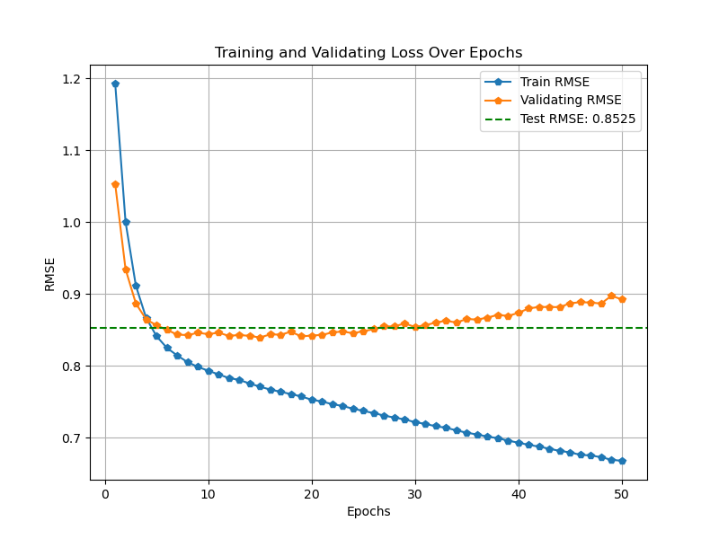

# 🎬 Multimodal Deep Learning-Based Recommendation System

[](https://pytorch.org/)
[]
[]
[]

---

## 🌟 Project Introduction

This project implements a **Multimodal Deep Learning-Based Recommendation System** using PyTorch. It leverages user and movie embeddings, BERT-based textual features, and genre information to predict movie ratings. The system is built on the MovieLens-1M dataset and supports automated feature extraction, model training, evaluation, and result visualization.

---

## 🗂️ Project Structure

```
Multimodal-DeepLearning-Based-Recommendation-System/
│
├── dataset/                # Dataset and feature files
│   ├── ml-1m/              # MovieLens-1M raw data
│   ├── movie_bert_dict.pkl # BERT+Genre feature dictionary
│   └── genre2idx.pkl       # Genre-to-index mapping
│
├── Models/
│   ├── Dataset.py          # PyTorch Dataset definition
│   ├── Recommender.py      # Recommendation model
│   └── dataLoader.py       # Data loading and preprocessing
│
├── utils/
│   └── BERT.py             # BERT feature extraction and saving
│
├── resultAnalyze/
│   └── loss_ananlyze.py    # Training loss visualization
│
├── train.py                # Main training script
└── README.md               # Project documentation
```

---

## 🧠 Principle Explanation

- **Multimodal Feature Fusion:**  
  The system combines user and movie embeddings with BERT-extracted textual features from movie titles and multi-hot encoded genre vectors, forming a rich representation for each movie.

- **Neural Collaborative Filtering:**  
  The model uses neural collaborative filtering (NCF) principles, employing embedding layers for users and movies, and a multi-layer perceptron (MLP) to learn complex interactions between user preferences and multimodal movie features.

- **End-to-End Deep Learning:**  
  The entire pipeline, from raw data to prediction, is implemented in PyTorch, supporting efficient training and easy extensibility.

---

## 🚀 Installation & Running

### 1. Environment Setup

```bash
# Clone the repository
git clone https://github.com/yourusername/Multimodal-DeepLearning-Based-Recommendation-System.git
cd Multimodal-DeepLearning-Based-Recommendation-System

# Install dependencies
pip install -r requirements.txt
# Or install manually
pip install torch transformers pandas numpy matplotlib scikit-learn
```

### 2. Prepare Dataset

- Download the [MovieLens-1M dataset](https://grouplens.org/datasets/movielens/1m/) and place it in `dataset/ml-1m/`.

### 3. Feature Extraction

```bash
# Extract BERT and genre features
utils/BERT.py
```

### 4. Train the Model

```bash
python main.py
```

### 5. Analyze Results

```bash
python resultAnalyze/loss_ananlyze.py
```

---

## 📊 Result Analysis

- The model achieves competitive loss on the validation set, demonstrating the effectiveness of multimodal feature fusion.
- Training and validation loss curves are visualized for performance monitoring.
- The system is extensible for further feature engineering and model improvements.

**Loss Curve Example:**



---

---
## 📝 Example: Generate Personalized Recommendations

After training, you can generate a personalized recommendation list for a user.  
For example, to get the top 10 recommended movies for user 1, run:

```bash
python generate_recommendation.py
```

**Example Output:**
```
Top 10 recommended movie IDs for user 1: [3680, 811, 3338, 787, 318, 527, 2609, 3517, 3236, 922]
```

---

## 🏷️ Key Features

- **Multimodal Feature Fusion** 
- **BERT-based Text Embedding** 
- **Genre Multi-hot Encoding** 
- **Neural Collaborative Filtering** 
- **Easy Visualization** 

---

## 📌 Future Work

- Incorporate user history sequences with LSTM/Transformer for sequential recommendation.
- Add more contextual features (e.g., timestamps, user demographics).
- Compare with traditional and other deep learning-based recommendation baselines.

---

## 📄 License

This project is licensed under the MIT License.

---